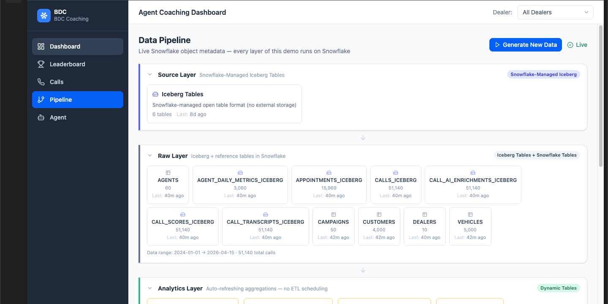
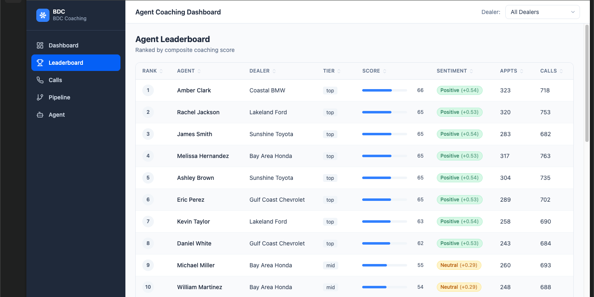
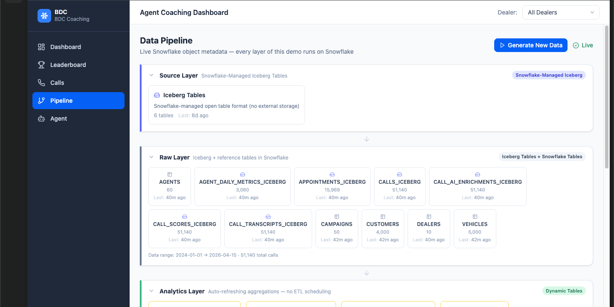
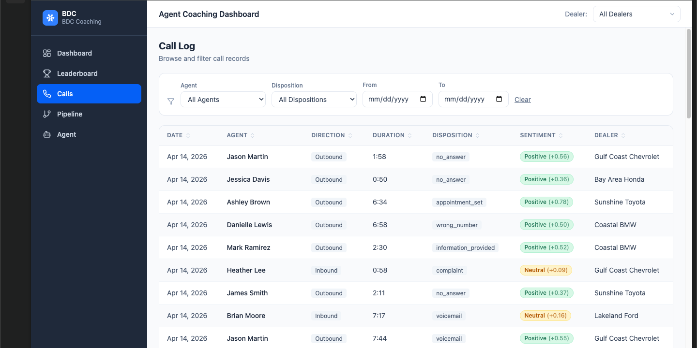
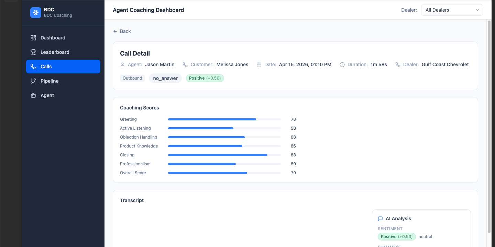
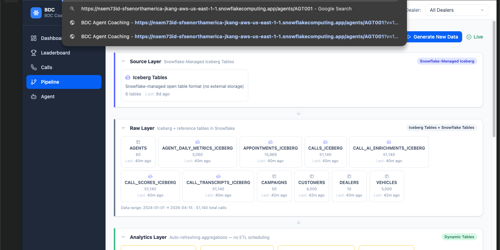
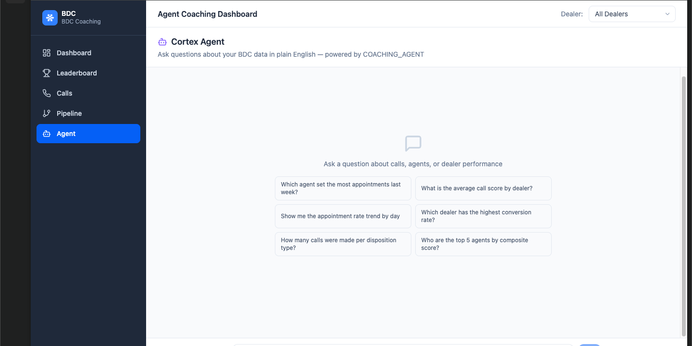

# BDC Agent Coaching Dashboard

[](https://www.snowflake.com)

> **TL;DR for SEs** — End-to-end Cortex Agent + SPCS demo replacing OpenAI + Pinecone + Vercel + a scheduler with one Snowflake account. 15K synthetic BDC call transcripts, Cortex Search RAG, streaming claude-4-sonnet coaching, Iceberg + DTs + Interactive Tables under the hood. One-command deploy (~15 min), teardown included. See [Slack blurb](#slack-blurb) to share internally.

<details>
<summary id="slack-blurb"><strong>Slack blurb — copy/paste to drive internal traffic</strong></summary>

```
:snowflake: New demo: *BDC Agent Coaching Dashboard* — end-to-end Snowflake-native AI app.

What it is: A call-center agent coaching app (automotive BDC as the reference scenario, pattern applies to any contact center) that replaces OpenAI + Pinecone + Vercel + a scheduler with one Snowflake account.

Under the hood:
• Cortex Agent (claude-4-sonnet) + Cortex Search RAG over 15K synthetic call transcripts
• Snowflake-managed Iceberg + Dynamic Tables + Interactive Tables (sub-second dashboard)
• SPCS hosts React + FastAPI + nginx w/ OAuth SSO
• DCM-managed schemas, daily task generates new calls

Deploy: `bash deploy/spcs/deploy-spcs.sh` (~15 min, ~2-3 credits). Teardown included.
Demo time: 20-25 min. Great fit for automotive, contact center, customer success, collections, inside sales — any agent-coaching conversation.

Repo: https://github.com/sfc-gh-jkang/bdc-demo  (pending public-release approval — DM me for access or a walkthrough)
```

</details>

<details>
<summary id="linkedin-post"><strong>LinkedIn post — public-facing (after repo is public)</strong></summary>

```
Every call center I've worked with has the same problem:

Thousands of calls a day. A handful of QA analysts. They listen to maybe 2% of calls, score them against a rubric, and hope the patterns they catch are the patterns that matter.

The patterns that matter are almost always in the 98% they didn't hear.

I built a reference app that fixes this — using only Snowflake.

Agent Coaching Dashboard: 15,000 synthetic calls, 30 agents, 5 locations. For every call, an AI-generated coaching score across 7 dimensions, a summary, a disposition class, sentiment, and follow-up actions. A manager can open any agent's profile and get an instant, grounded coaching summary — with citations back to specific call transcripts.

What's interesting is what's not in the stack:

❌ No OpenAI
❌ No Pinecone / Weaviate / any vector DB
❌ No Airflow / Dagster / scheduler
❌ No Vercel / separate hosting
❌ No cross-cloud data movement

Instead:

✅ Cortex Agent with claude-4-sonnet for orchestration
✅ Cortex Search for RAG over call transcripts (no vector DB to manage)
✅ Snowflake-managed Iceberg tables as the canonical store
✅ Dynamic Tables for auto-refreshing aggregates (no scheduler)
✅ Interactive Tables for sub-second dashboard queries
✅ Snowpark Container Services hosts the React + FastAPI app inside the Snowflake boundary
✅ Database Change Management versions all objects as code

One bill. One security boundary. One deploy command (~15 minutes end to end).

The scenario I picked — automotive BDC — is arbitrary. The exact same pattern works for customer success, collections, inside sales, healthcare call centers, field service — anywhere agents talk to people on the phone and someone needs to coach them.

Repo is public: github.com/sfc-gh-jkang/bdc-demo

If you're responsible for contact center QA and the numbers above look familiar, this is worth 20 minutes of your time.

#Snowflake #CortexAI #ContactCenter #AgentCoaching #AI
```

**Notes:**
- Only post after the repo is public (CASEC/LIFT approved + visibility flipped).
- Update `github.com/sfc-gh-jkang/bdc-demo` in the post to the final URL (may end up under `Snowflake-Labs/*` if transferred).
- Consider attaching a 30-second screen recording of the coaching summary streaming in — much higher engagement than text-only posts.
- Skip hashtag spam; 4–5 relevant tags is the sweet spot.

</details>

## Summary

**TL;DR** — A production-style AI coaching dashboard for automotive BDC agents, built entirely on Snowflake.

### Screenshots

| Dashboard | Leaderboard |
|---|---|
|  |  |

| Pipeline | Call Log |
|---|---|
|  |  |

| Call Detail | Agent Detail |
|---|---|
|  |  |



### The Business Problem

Automotive BDC (Business Development Center) managers oversee dozens of agents making thousands of calls per month. Listening to every call is impossible, and traditional QA sampling misses patterns. Managers need a way to surface coaching insights automatically — grounded in actual call data, not generic advice.

### What This Demo Proves

Every layer of the application runs on Snowflake — from raw data ingestion through AI-powered coaching:

| Snowflake Feature | What It Does In This Demo |
|---|---|
| **Cortex Agent** | Generates structured coaching summaries and powers an interactive chat assistant using `claude-4-sonnet` with tool use and SSE streaming |
| **Cortex Search** | Provides RAG (retrieval-augmented generation) over 15K call transcripts so coaching recommendations cite real call examples |
| **Dynamic Tables** | Auto-refreshes the leaderboard, dashboard KPIs, and call detail aggregations — no scheduled ETL jobs |
| **Interactive Tables** | Delivers sub-second query latency for the coaching schema powering the agent detail and call detail pages |
| **Snowflake-managed Iceberg Tables** | Six `CATALOG='SNOWFLAKE'` Iceberg tables store canonical data (calls, transcripts, scores, enrichments, appointments, agent metrics) — no external volume or S3 config needed |
| **Snowpark Container Services (SPCS)** | Hosts the full 3-container app (React frontend + FastAPI backend + nginx router) on Snowflake compute with OAuth SSO |
| **Database Change Management (DCM)** | Manages all Snowflake objects (tables, dynamic tables, search services, agents) as version-controlled code |

### Results

- **15,000 calls** across **30 agents** at **5 dealerships** over 30 days of synthetic data
- Real-time AI coaching summaries with token usage and latency metadata
- Interactive RAG-powered chat that references specific call transcripts
- Single-command deployment to SPCS with zero-downtime service updates

### Why It Matters

This demo collapses what would normally require Postgres + Debezium + Kafka + dbt + Pinecone + OpenAI + Vercel + Terraform into a single platform. Every component — data storage (Iceberg), data pipelines (Dynamic Tables), vector search (Cortex Search), LLM orchestration (Cortex Agent), app hosting (SPCS), and schema management (DCM) — runs on Snowflake.

### Tech Stack

React 19 · TailwindCSS 4 · Vite · FastAPI · Snowflake Cortex Agent · Cortex Search · Dynamic Tables · Interactive Tables · Snowflake-managed Iceberg Tables · SPCS · DCM

---

## Architecture

```
Browser
  |
  v
SPCS Service (Snowpark Container Services)
  ├── router (nginx) :8000
  │     ├─ /api/*  → backend :8081
  │     └─ /*      → frontend :5173
  ├── frontend (React + Vite) :5173
  └── backend (FastAPI + Python) :8081
        ├── Snowflake Connector (SQL queries)
        └── Cortex Agent REST API → AI summaries + interactive chat (SSE streaming)

Snowflake Objects
  ├── RAW schema          – 16 source tables + 6 Snowflake-managed Iceberg tables
  ├── ANALYTICS schema    – Dynamic Tables (leaderboard, call details, dashboard metrics)
  ├── COACHING schema     – Interactive Tables, Cortex Search Service, Cortex Agent
  └── SPCS schema         – Compute pool, service, image repository

Data Flow
  Parquet seed → RAW tables → Iceberg tables → Dynamic Tables → Interactive Tables
                                  ↓                                    ↓
                          Cortex Search (RAG)              Sub-second dashboard queries
                                  ↓
                          Cortex Agent (coaching)
```

## Key Features

| Feature | Snowflake Capability |
|---|---|
| Real-time leaderboard | Dynamic Tables (auto-refresh) |
| Call details with scores | Interactive Tables (low-latency) |
| Pipeline health monitoring | Synthetic data in RAW tables |
| AI coaching summaries | Cortex Agent with claude-4-sonnet (buffered response) |
| Interactive coaching chat | Cortex Agent + Cortex Search (SSE streaming, RAG over transcripts) |
| Token & latency metadata | Cortex Agent response metadata (model, tokens, cache, latency) |
| Containerized deployment | Snowpark Container Services (SPCS) |

## Project Structure

```
bdc-demo/
├── backend/          Python FastAPI backend
│   ├── app/
│   │   ├── main.py           App entrypoint + routers
│   │   ├── db.py             Snowflake connection pool + query helpers
│   │   ├── cortex.py         Cortex Agent REST API helper (SSE streaming + metadata)
│   │   └── routes/
│   │       ├── dashboard.py  Dashboard metrics
│   │       ├── leaderboard.py Agent leaderboard
│   │       ├── agents.py     Agent list + detail
│   │       ├── calls.py      Call list + detail
│   │       ├── coaching.py   AI summary + chat (both via Cortex Agent)
│   │       └── pipeline.py   Data pipeline status
│   ├── Dockerfile
│   └── pyproject.toml
├── frontend/         React 19 + TailwindCSS 4 + TanStack Query
│   ├── src/
│   │   ├── App.tsx
│   │   ├── api/              API hooks (react-query)
│   │   ├── components/       Reusable UI (DataTable, CoachingChat, ...)
│   │   ├── pages/            Route pages (Dashboard, Leaderboard, AgentDetail, ...)
│   │   └── context/          Dealer filter context
│   ├── Dockerfile
│   └── package.json
├── router/           nginx reverse proxy (envsubst templates)
│   ├── nginx.conf.template
│   └── Dockerfile
├── data/             Synthetic data generator (Python)
├── sql/              Snowflake DDL scripts
├── dcm/              Database Change Management config
├── deploy/
│   ├── deploy.env        SPCS deployment config (not committed)
│   └── spcs/
│       └── deploy-spcs.sh  One-command build + push + deploy
├── observe/          Observability config
└── specs/            Service spec templates
```

## Prerequisites

- Snowflake account with ACCOUNTADMIN access (AWS or Azure; tested on AWS)
- [Snowflake CLI](https://docs.snowflake.com/developer-guide/snowflake-cli/index) (`snow`) 3.0+ installed
- Docker Desktop (or Colima / Rancher Desktop) with buildx
- Node.js 20+ and Python 3.11+
- `uv` recommended for Python deps (`brew install uv`)
- A browser that handles Snowflake OAuth SSO cleanly (Prisma Access Browser, Chrome, or Safari). The SPCS endpoint requires OAuth login every time.

## For Solution Engineers

This section captures the SE-specific concerns the rest of the README does not cover.

### Deploy time & cost

| Phase | Duration | Credits |
|---|---|---|
| One-time `setup.sql` | <1 min | ~0 |
| `uv run python generator.py` (local) | 2–4 min | 0 |
| `deploy-spcs.sh` full (DCM + load + images + service) | 12–18 min | ~2–3 credits (standard WH + image build on compute pool) |
| Idle SPCS service (compute pool running) | — | ~0.11 credits/hour on `CPU_X64_S` (1 node) |
| Daily Cortex Agent usage during a live demo | 30–60 min | ~1–2 credits (agent + Cortex Search + interactive WH) |

**Always run `bash teardown.sh --nuclear --yes` after a demo** or drop the compute pool. Idle `CPU_X64_S` accrues ~2.6 credits/day if left running.

### Recommended demo flow (20–25 min)

1. **Business framing** (2 min) — BDC agent coaching problem, why manual QA doesn't scale.
2. **Dashboard page** (3 min) — Highlight KPI cards + dealer breakdown. Point out "Powered by Dynamic Tables" — no ETL scheduler.
3. **Leaderboard** (2 min) — Sub-second queries backed by Interactive Tables. Click into a low-performing agent.
4. **Agent Detail → AI Coaching Summary** (5 min) — Watch SSE streaming. Call out `claude-4-sonnet` model + token/latency metadata. Compare: "this replaces OpenAI + a vector DB + a scheduler."
5. **Interactive Coaching Chat** (4 min) — Ask "What should this agent focus on?" — watch RAG over 15K transcripts via Cortex Search. Follow-up: "Show me a call where they handled objections well."
6. **Call Detail** (2 min) — 7-dimension coaching scores + transcript analysis.
7. **Pipeline page** (2 min) — Shows the full Snowflake-native stack (RAW → Iceberg → DT → IT → Cortex → SPCS). Click "Generate New Data" to trigger the daily task live.
8. **Analyst page** (3 min) — Open-ended chat demonstrating the same agent without per-agent context. Optional depending on audience.

### Talking points by persona

- **Data engineer** — zero external pipeline, Iceberg open format, DCM versioning, `DOWNSTREAM` target lag.
- **ML/AI lead** — Cortex Agent tool use, RAG without managing a vector DB, native model governance.
- **Platform/Security** — runs entirely inside the customer's Snowflake boundary, OAuth SSO auto-wired, no cross-account egress.
- **Finance** — one bill, consumption-based, no separate Vercel/OpenAI/Pinecone invoices.

### Before the demo (5-min pre-flight)

```bash
# 1. Warm the SPCS service (first load after idle can take 30-60s)
curl -I "$(snow sql -c aws_spcs -q "SHOW ENDPOINTS IN SERVICE BDC_DEMO.SPCS.BDC_COACHING_SERVICE" --format json | jq -r '.[] | select(.is_public=="true") | .ingress_url')"
# 2. Confirm daily task has run today
snow sql -c aws_spcs -q "SELECT COUNT(*) FROM BDC_DEMO.RAW.CALLS_ICEBERG WHERE CALL_DATE = CURRENT_DATE()"
# 3. Verify interactive WH is RESUMED
snow sql -c aws_spcs -q "SHOW WAREHOUSES LIKE 'BDC_INTERACTIVE_WH'"
```

### Common demo-time gotchas

- **First Cortex Agent call after idle** is slow (~8–12s cold start). Warm it in pre-flight.
- **OAuth redirect blocks in-browser iframes** — never embed the SPCS URL in Slides/Docs; open in a new tab.
- **Interactive WH auto-suspends after 5 min idle** — resumes on next query, but adds ~2s latency. Resume manually before a demo if you're presenting.
- **Network hiccup on demo wifi** — have a screen recording of the chat + coaching summary as a backup.

### Customizing for a specific customer

- Swap dealer names/industries by editing `DEALER_DATA` in `data/generator.py` (line ~41).
- Change agent skill distribution via `TIER_DIST` (line ~84).
- Retarget Cortex Agent instructions in `sql/03-cortex-objects.sql` — the orchestration prompt is plain YAML, easy to adapt for retail, healthcare BDC, etc.

## Setup

### 1. Configure Connection

```bash
cp deploy/deploy.env.example deploy/deploy.env
# Edit deploy.env with your Snowflake connection details
```

### 2. One-Time SPCS Setup

```bash
# Creates compute pool, image repo, EAI, network rule
snow sql -c aws_spcs -f deploy/spcs/setup.sql
```

### 3. Generate Synthetic Data

```bash
cd data
uv sync          # or: python -m venv .venv && source .venv/bin/activate && pip install -e .
uv run python generator.py
# Outputs: data/output/*.parquet and data/output/*.csv (~44 MB total)
```

### 4. Full Deploy

```bash
bash deploy/spcs/deploy-spcs.sh
```

This runs the complete deploy pipeline:

1. **pre_deploy.sql** — Creates BDC_DEMO database, RAW schema, 6 Iceberg table DDLs
2. **DCM deploy** — Creates schemas, RAW tables, Dynamic Tables, warehouses, stages
3. **Parquet loading** — Uploads seed data to stage, COPY INTO 16 RAW tables
4. **Iceberg seeding** — INSERT INTO *_ICEBERG SELECT * FROM RAW.*
5. **post_deploy.sql** — Creates Interactive Tables + Interactive Warehouse
6. **Cortex objects** — Creates daily task, Cortex Search Service, Cortex Agent
7. **Docker build + push** — Builds and pushes 3 container images with unique tags
8. **Service deploy** — CREATE or ALTER SERVICE, wait for READY, print endpoint URL

## Local Development

### Backend

```bash
cd backend
uv sync          # or: python -m venv .venv && source .venv/bin/activate && pip install -e .
uv run uvicorn app.main:app --reload --port 8081
```

Requires a Snowflake connection named `aws_spcs` in `~/.snowflake/connections.toml`.

### Frontend

```bash
cd frontend
npm install
npm run dev
```

Vite proxies `/api` requests to `localhost:8081` in dev mode.

## SPCS Deployment

### Quick Deploy

```bash
bash deploy/spcs/deploy-spcs.sh              # full deploy (DCM + images + service)
bash deploy/spcs/deploy-spcs.sh --images     # images + service only (skip DCM)
bash deploy/spcs/deploy-spcs.sh --dcm        # DCM only (skip images + service)
```

### Zero-Downtime Updates

On subsequent deploys, the script detects the existing service and uses ALTER SERVICE
(SUSPEND → update spec → RESUME) to preserve the endpoint URL.

### Teardown

```bash
bash teardown.sh                  # interactive — drops service, pool, schemas
bash teardown.sh --nuclear --yes  # non-interactive — DROP DATABASE CASCADE
```

### SPCS Environment Notes

- `SNOWFLAKE_HOST` and `SNOWFLAKE_ACCOUNT` are **auto-injected** by SPCS — do not set manually
- The backend reads the OAuth token from `/snowflake/session/token` (refreshed every few minutes)
- The Cortex Agent REST API is called via the internal `SNOWFLAKE_HOST` endpoint using the same OAuth token
- Service runs as the owner role (ACCOUNTADMIN) — no additional grants needed

## Cortex AI Integration

### Coaching Summary (`GET /api/agents/{id}/summary`)

Fetches the agent's last 5 calls (scores, summaries, dispositions) and passes them
to the `COACHING_AGENT` Cortex Agent (claude-4-sonnet) to generate a structured
coaching summary with strengths, areas for improvement, and action items.
Returns metadata (model, token usage, cache stats, latency).

### Coaching Chat (`POST /api/agents/{id}/chat`)

Streams a conversation with the `COACHING_AGENT` Cortex Agent via **Server-Sent Events**.
The agent uses a `cortex_search` tool to RAG over 15K call transcripts, providing
data-driven coaching recommendations grounded in actual call examples.

SSE events:
- `event: delta` — text chunk (`{"text": "..."}`)
- `event: metadata` — final metadata (model, tokens, cache, latency)
- `event: done` — stream terminator
- `event: error` — on failures

**Request:**
```json
{
  "message": "What should this agent focus on?",
  "history": [{"role": "user", "content": "..."}, {"role": "assistant", "content": "..."}]
}
```

**Response:** Server-Sent Events stream with `data: {"text": "..."}` chunks.

## Environment Variables

All SPCS deployment configuration lives in `deploy/deploy.env` (copy from `deploy/deploy.env.example`). This file is `.gitignore`'d.

| Variable | Description | Example |
|---|---|---|
| `SNOWFLAKE_CONNECTION` | Named connection from `~/.snowflake/connections.toml` | `aws_spcs` |
| `SPCS_DATABASE` | Target database for all objects | `BDC_DEMO` |
| `SPCS_SCHEMA` | Schema for SPCS service objects | `SPCS` |
| `SPCS_COMPUTE_POOL` | Compute pool name (must be `CPU_X64_S` or larger) | `BDC_POOL` |
| `SPCS_SERVICE_NAME` | SPCS service name | `BDC_COACHING_SERVICE` |
| `SPCS_IMAGE_REPO` | Image repository for Docker images | `BDC_IMAGES` |
| `SPCS_STD_WAREHOUSE` | Standard warehouse for RAW/ANALYTICS queries and DT refreshes | `BDC_STD_WH` |
| `SPCS_INTERACTIVE_WAREHOUSE` | Interactive warehouse for sub-second COACHING schema queries | `BDC_INTERACTIVE_WH` |
| `SPCS_EAI` | External Access Integration name (for outbound Cortex Agent API calls) | `BDC_EAI` |
| `SPCS_EGRESS_RULE` | Network rule allowing HTTPS egress | `BDC_EGRESS_RULE` |

The backend also reads these **auto-injected SPCS environment variables** (do not set manually):
- `SNOWFLAKE_HOST` — Internal Snowflake hostname for Cortex API calls
- `SNOWFLAKE_ACCOUNT` — Account identifier
- OAuth token is read from `/snowflake/session/token` (refreshed automatically)

---

## Data Model

### Schemas

| Schema | Purpose |
|---|---|
| `RAW` | Source tables (16 standard + 6 Iceberg) — seed data + daily-generated data |
| `ANALYTICS` | Dynamic Tables — auto-refreshed aggregations from RAW/Iceberg |
| `COACHING` | Interactive Tables + Cortex Search Service + Cortex Agent |
| `SPCS` | Compute pool, service, image repository |

### RAW Tables (16 standard tables, DCM-managed)

Reference data (small, static):

| Table | Rows | Description |
|---|---|---|
| `DEALERS` | 5 | Auto dealerships (Tampa, St. Petersburg, Lakeland, Sarasota, Naples) |
| `CAMPAIGNS` | 25 | Outbound/inbound call campaigns (5 per dealer: service_recall, lease_maturity, csi_survey, conquest, retention) |

Operational data:

| Table | Rows | Description |
|---|---|---|
| `AGENTS` | 30 | BDC agents (6 per dealer, skill tiers: top/mid/bottom at 20%/50%/30%) |
| `CUSTOMERS` | 2,000 | Vehicle owners and prospects (Florida locations) |
| `VEHICLES` | 2,500 | Customer vehicles (brand-matched + 15% trade-ins, 25% leases) |
| `SERVICE_HISTORY` | 10,000 | Vehicle service records (16 service types) |
| `CALLS` | 15,000 | Phone calls with time-of-day distribution and tier-correlated dispositions |
| `CALL_TRANSCRIPTS` | 15,000 | Multi-turn call transcripts (12 scenario templates with 2-3 variants each) |
| `CALL_SCORES` | 15,000 | AI-derived call quality scores (7 dimensions + overall) |
| `APPOINTMENTS` | 4,500 | Service/sales appointments linked to calls |
| `TASKS` | 8,000 | Agent follow-up tasks |
| `TEXT_MESSAGES` | 5,000 | SMS messages |
| `EMAIL_LOGS` | 3,000 | Email campaign logs |

AI enrichment:

| Table | Rows | Description |
|---|---|---|
| `CALL_AI_ENRICHMENTS` | 15,000 | LLM-generated enrichments (sentiment, summary, disposition class, follow-up actions, objections) |
| `AGENT_DAILY_METRICS` | ~900 | Pre-aggregated agent performance by day (1 row per agent per day) |
| `PIPELINE_STATUS` | 6 | Pipeline stage health tracking |

All tables have `CHANGE_TRACKING = TRUE` to enable incremental refresh for downstream Dynamic Tables.

### Iceberg Tables (6, Snowflake-managed)

These store the canonical data that grows daily via the `DAILY_CALL_GENERATOR` task. Dynamic Tables source from these (not the RAW copies).

| Table | Catalog | Description |
|---|---|---|
| `CALLS_ICEBERG` | `SNOWFLAKE` | Canonical call records |
| `CALL_TRANSCRIPTS_ICEBERG` | `SNOWFLAKE` | Canonical transcripts |
| `CALL_SCORES_ICEBERG` | `SNOWFLAKE` | Canonical quality scores |
| `CALL_AI_ENRICHMENTS_ICEBERG` | `SNOWFLAKE` | Canonical AI enrichments |
| `APPOINTMENTS_ICEBERG` | `SNOWFLAKE` | Canonical appointments |
| `AGENT_DAILY_METRICS_ICEBERG` | `SNOWFLAKE` | Canonical per-agent daily metrics |

All use `CATALOG = 'SNOWFLAKE'` (no external volume, no S3). On first deploy, they are seeded from RAW tables. After that, the daily task inserts directly into Iceberg tables.

### Dynamic Tables (5, ANALYTICS schema)

| Dynamic Table | Target Lag | Sources |
|---|---|---|
| `CALL_AI_ENRICHMENTS` | `DOWNSTREAM` | Iceberg: calls, enrichments, transcripts |
| `AGENT_DAILY_METRICS` | `DOWNSTREAM` | Iceberg: agent_daily_metrics + RAW: agents, dealers |
| `DASHBOARD_METRICS` | 5 minutes | Iceberg: calls, enrichments, scores + RAW: dealers, customers |
| `AGENT_LEADERBOARD` | 5 minutes | Iceberg: calls, scores, enrichments + RAW: agents, dealers |
| `CALL_DETAILS` | 5 minutes | Iceberg: calls, transcripts, scores, enrichments + RAW: agents, customers, dealers |

Tables with `TARGET_LAG = 'DOWNSTREAM'` only refresh when their downstream consumers (Interactive Tables) need fresh data.

### Interactive Tables (3, COACHING schema)

| Interactive Table | Cluster Key | Source Dynamic Table |
|---|---|---|
| `DASHBOARD_METRICS` | `DEALER_ID` | `ANALYTICS.DASHBOARD_METRICS` |
| `AGENT_LEADERBOARD` | `DEALER_ID` | `ANALYTICS.AGENT_LEADERBOARD` |
| `CALL_DETAILS` | `DEALER_ID, CALL_DATE` | `ANALYTICS.CALL_DETAILS` |

All have `TARGET_LAG = '5 minutes'` and are served by the `BDC_INTERACTIVE_WH` Interactive Warehouse for sub-second query latency.

### Data Flow

```
Parquet files ──▶ 16 RAW tables (seed load)
                       │
                       ▼
              6 Iceberg tables ◀── Daily Call Generator (daily INSERT)
                       │
                       ▼
              5 Dynamic Tables (auto-refresh)
                       │
                       ▼
              3 Interactive Tables ──▶ React App (sub-second queries)
                       │
              Cortex Search Service ──▶ Cortex Agent (RAG over transcripts)
```

---

## Synthetic Data Generator

### Seed Data (`data/generator.py`)

The seed generator produces 30 days of realistic BDC data (Jan 1–30, 2024) with deterministic output (`SEED=42`).

**Usage:**
```bash
cd data
uv run --project . python generator.py
# Outputs: data/output/*.parquet and data/output/*.csv
```

**What it generates:**

| Entity | Count | Key Patterns |
|---|---|---|
| Dealers | 5 | Florida dealerships (Toyota, Honda, Ford, Chevrolet, BMW) |
| Agents | 30 | 6 per dealer, skill tiers: 20% top, 50% mid, 30% bottom |
| Customers | 2,000 | Florida cities, realistic contact info, opt-in/DNC flags |
| Vehicles | 2,500 | Brand-matched models + 15% trade-in brands (Nissan, Hyundai, Kia), 25% leases |
| Service History | 10,000 | 16 service types, CSI scores, labor/parts costs |
| Campaigns | 25 | 5 types per dealer (service_recall, lease_maturity, csi_survey, conquest, retention) |
| Calls | 15,000 | Time-of-day curve (peaks 9-11 AM, 2-4 PM), tier-correlated dispositions |
| Transcripts | 15,000 | 12 scenario templates × 2-3 variants, multi-turn with timestamps |
| Call Scores | 15,000 | 7 coaching dimensions, tier-weighted (top: base 75, mid: base 55, bottom: base 35) |
| AI Enrichments | 15,000 | Sentiment scores, summaries, disposition classes, follow-up actions |
| Appointments | ~4,500 | From `appointment_set` calls, 70% service / 30% sales |
| Tasks | 8,000 | Follow-up tasks with priority and status |
| Text Messages | 5,000 | SMS messages with delivery status |
| Email Logs | 3,000 | Campaign emails with open tracking |
| Agent Daily Metrics | ~900 | Pre-aggregated daily stats per agent |
| Pipeline Status | 6 | Pipeline stage health records |

**Customization:**
- `SEED` — Change for different random output (line 19)
- `START_DATE` / `END_DATE` — Adjust the date range (lines 26-27)
- `N_DAYS` — Derived from date range
- `DEALER_DATA` — Add/remove dealerships (line 41)
- `TIER_DIST` — Adjust agent skill distribution (line 84)
- `DISP_PROBS` — Tune call disposition probabilities (line 314)
- `SCENARIO_TEMPLATES` — Add/modify transcript templates (line 394+)

**Transcript scenarios:** 12 templates covering appointment success/decline, recall notifications, oil change reminders, lease maturity, CSI follow-ups, voicemail, complaints, trade-in inquiries, service upsells, test drive scheduling, and wrong numbers. Each template has 2-3 conversation variants with realistic multi-turn dialogue and templatized customer/agent/vehicle references.

---

## Daily Call Generator

The `DAILY_CALL_GENERATOR` task produces ~450-550 new synthetic calls each day and inserts them directly into Snowflake-managed Iceberg tables.

### Stored Procedure: `BDC_DEMO.RAW.GENERATE_DAILY_CALLS()`

- **Language:** Python 3.11 (Snowpark)
- **Execution:** `EXECUTE AS CALLER`
- **Idempotent:** Checks if data already exists for `CURRENT_DATE` before generating

**What it produces per run:**

| Output | Count | Destination |
|---|---|---|
| Calls | 450–550 | `CALLS_ICEBERG` |
| Transcripts | 450–550 | `CALL_TRANSCRIPTS_ICEBERG` |
| Call Scores | 450–550 | `CALL_SCORES_ICEBERG` |
| AI Enrichments | 450–550 | `CALL_AI_ENRICHMENTS_ICEBERG` |
| Appointments | ~140–170 | `APPOINTMENTS_ICEBERG` (from `appointment_set` calls) |
| Agent Metrics | ~30 | `AGENT_DAILY_METRICS_ICEBERG` (1 per active agent) |

**Score generation by skill tier:**

| Tier | Base Score | Random Range | Typical Overall |
|---|---|---|---|
| Top (20%) | 75 | +0–25 | 75–100 |
| Mid (50%) | 50 | +0–40 | 50–90 |
| Bottom (30%) | 30 | +0–45 | 30–75 |

**Disposition distribution (weighted):**
`appointment_set` (31%) · `voicemail` (25%) · `no_answer` (14%) · `callback_requested` (10%) · `information_provided` (10%) · `complaint` (5%) · `wrong_number` (3%) · `do_not_call` (2%)

### Task Schedule

```sql
SCHEDULE = 'USING CRON 0 10 * * * America/New_York'
-- Runs daily at 10:00 AM Eastern
```

**Manual trigger** — from the Pipeline page "Generate New Data" button, or:
```sql
EXECUTE TASK BDC_DEMO.RAW.DAILY_CALL_GENERATOR;
```

**Pipeline refresh chain** after new data lands:
1. Iceberg tables receive new rows (direct INSERT)
2. Dynamic Tables detect changes and auto-refresh
3. Interactive Tables receive refreshed DT data
4. Dashboard reflects new data within ~5 minutes

---

## Screenshots

> **Note:** The SPCS app endpoint requires Snowflake OAuth SSO authentication, so automated screenshots cannot be captured. To view the app, deploy the service and navigate to the endpoint URL printed by `deploy-spcs.sh`.

### App Pages

| Route | Page | Description |
|---|---|---|
| `/` | Dashboard | KPI cards (Total Calls, Appointments Set, Avg Sentiment, Avg Call Score), dealer breakdown table, Snowflake feature showcase |
| `/leaderboard` | Leaderboard | Agent ranking table with composite scores, sentiment badges, clickable rows |
| `/agents/:id` | Agent Detail | Agent profile, stat cards, AI coaching summary (SSE streaming with status steps), recent calls, interactive coaching chat |
| `/calls` | Calls | Paginated call table (50/page) with agent/disposition/date filters |
| `/calls/:id` | Call Detail | Call metadata, 7-dimension coaching scores, transcript viewer with AI analysis |
| `/pipeline` | Pipeline | Visual pipeline flow (Sources → RAW → Iceberg → DTs → ITs → Cortex → SPCS), task run history, "Generate New Data" button |
| `/analyst` | Analyst | Full-page chat with Cortex Agent, sample question cards, SSE streaming with tool-use status steps, metadata badges |

---

## Known Gotchas

### Parquet Loading
- **`USE_LOGICAL_TYPE = TRUE`** is required for all parquet COPY INTO statements. Without it, dates are stored as epoch microseconds (e.g., `1609459200000000`) which fail all type casts.
- Even with `USE_LOGICAL_TYPE`, 4 tables (AGENTS, DEALERS, AGENT_DAILY_METRICS, TASKS) need **explicit `TO_DATE()` transforms** because their DATE columns receive timestamp strings like `"2020-01-01 00:00:00.000"` which cannot auto-cast to DATE. The deploy script handles this with per-table SELECT-based COPY INTO.
- Tables with only TIMESTAMP_NTZ columns (CALLS, APPOINTMENTS, etc.) work fine with generic `MATCH_BY_COLUMN_NAME`.

### DCM (Database Change Management)
- **`snow dcm create` is required before the first `snow dcm deploy`**. The deploy script handles this automatically.
- Drop syntax is `DROP DCM PROJECT IF EXISTS`, not `DROP DATABASE CHANGE MANAGEMENT`.

### SPCS
- **CPU_X64_XS is too small** for 3 containers (0.9 vCPU total requests). Use **CPU_X64_S** or higher.
- SPCS **image registry tokens expire quickly**. The deploy script logs in immediately before pushing.
- Use **`SHOW ENDPOINTS IN SERVICE`** for endpoint URLs, not `SYSTEM$GET_SERVICE_STATUS` (which only returns container status).
- Always use **unique image tags** (timestamp-based) — SPCS caches `:latest`.
- First-deploy `CREATE SERVICE` must include `EXTERNAL_ACCESS_INTEGRATIONS` for outbound network access.

### Interactive Tables
- Interactive warehouse can **only query Interactive Tables** (not regular tables).
- Backend uses a dual-warehouse pattern: standard WH for RAW/ANALYTICS queries, interactive WH for COACHING queries.
- Minimum Interactive warehouse size is **XSMALL** (not XS).

## Troubleshooting

### Deployment Issues

| Problem | Cause | Fix |
|---|---|---|
| `snow dcm deploy` fails with "project not found" | DCM project not created yet | Run `snow dcm create` first (the deploy script handles this) |
| Docker push fails with 401 | Registry token expired | Run `snow spcs image-registry login` immediately before pushing |
| Service stuck in `PENDING` | Compute pool not started or too small | Check `DESCRIBE COMPUTE POOL <name>` — use `CPU_X64_S` or larger |
| Service shows `READY` but endpoint returns 502 | Containers still starting (React build takes ~30s) | Wait 60 seconds and retry; check `SYSTEM$GET_SERVICE_LOGS` |
| `CREATE SERVICE` fails with EAI error | Missing External Access Integration | Run `setup.sql` first to create the EAI and network rule |

### Runtime Issues

| Problem | Cause | Fix |
|---|---|---|
| Dashboard shows no data | Iceberg tables empty or DTs not refreshed | Check Iceberg row counts; run `ALTER DYNAMIC TABLE ... REFRESH` manually |
| AI coaching summary returns error | Cortex Agent not created or EAI missing | Verify `SHOW CORTEX AGENTS` and ensure `BDC_EAI` exists |
| Interactive queries fail with "warehouse cannot query this table" | Using interactive WH on non-interactive table | The backend uses dual-warehouse routing — interactive WH only for COACHING schema |
| Dates show as epoch numbers (e.g., `1609459200000000`) | Parquet loaded without `USE_LOGICAL_TYPE = TRUE` | Reload data with `USE_LOGICAL_TYPE = TRUE` in COPY INTO |
| Daily task says "Data already exists, skipping" | Task already ran for today | Expected behavior — the task is idempotent. To force regeneration, delete today's rows from `CALLS_ICEBERG` first |

### Useful Diagnostic Commands

```sql
-- Check service status
SHOW ENDPOINTS IN SERVICE BDC_DEMO.SPCS.BDC_COACHING_SERVICE;
SELECT SYSTEM$GET_SERVICE_STATUS('BDC_DEMO.SPCS.BDC_COACHING_SERVICE');

-- Check container logs
SELECT SYSTEM$GET_SERVICE_LOGS('BDC_DEMO.SPCS.BDC_COACHING_SERVICE', '0', 'backend', 50);
SELECT SYSTEM$GET_SERVICE_LOGS('BDC_DEMO.SPCS.BDC_COACHING_SERVICE', '0', 'frontend', 50);
SELECT SYSTEM$GET_SERVICE_LOGS('BDC_DEMO.SPCS.BDC_COACHING_SERVICE', '0', 'router', 50);

-- Check Dynamic Table health
SELECT NAME, SCHEDULING_STATE, LAST_COMPLETED_REFRESH_STATE
FROM TABLE(INFORMATION_SCHEMA.DYNAMIC_TABLES())
WHERE SCHEMA_NAME = 'ANALYTICS';

-- Check daily task history
SELECT *
FROM TABLE(INFORMATION_SCHEMA.TASK_HISTORY(TASK_NAME => 'DAILY_CALL_GENERATOR'))
ORDER BY SCHEDULED_TIME DESC LIMIT 10;

-- Check Iceberg table row counts
SELECT 'CALLS_ICEBERG' AS TBL, COUNT(*) AS CNT FROM BDC_DEMO.RAW.CALLS_ICEBERG
UNION ALL SELECT 'CALL_SCORES_ICEBERG', COUNT(*) FROM BDC_DEMO.RAW.CALL_SCORES_ICEBERG
UNION ALL SELECT 'APPOINTMENTS_ICEBERG', COUNT(*) FROM BDC_DEMO.RAW.APPOINTMENTS_ICEBERG;
```

---

## Repository Owner

- **Owner:** John Kang (john.kang@snowflake.com / [@sfc-gh-jkang](https://github.com/sfc-gh-jkang))
- **Access requests:** Open a [CASEC Jira](https://snowflakecomputing.atlassian.net/) for access changes
- **License:** Apache-2.0
